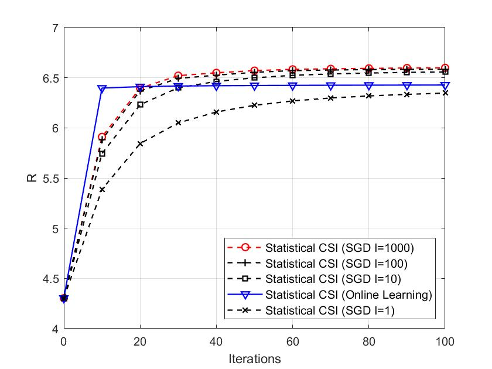
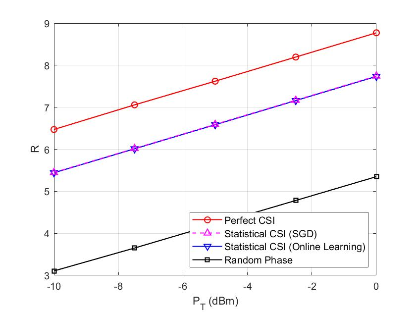

## IRS opt statistical CSI

This repository contains the source codes of the paper ``Intelligent Reflecting Surface Configuration With Historical Channel Observations'' published in IEEE Wireless Communications Letters.

The main motivation of this work is that in existing works, the IRS configuration with statistical CSI is actually only based on the LoS-link CSI, and the spatial correlation of the NLoS channel is ignored. This kind of algorithm is suboptimal and may perform poorly when the channel gain of the LoS-link is small. 

In this paper, we propose a general IRS statistical CSI configuration algorithm. The statistical CSI is directly learnt from the historical channel observations. Our algorithm can be adopted to any statistical CSI model even for the case when there is no LoS link between BS and IRS.

## Introduction of the codes

### Verify the convergence of the proposed two algorithms

Run the file ``plot_convergence.m''. You may get the following figure

The related code files for proposed algorithms are:

+ ``convergence_minibatch_SGD.m'': mini-batch SGD algorithm to extract the statistical CSI
+ ``convergence_proposed.m'': online learning algorithm to extract the statistical CSI

### Plot Fig.2

Run the file ``plot_fig_2.m''. You may get the following figure

The following are the main code files for the 4 algorihtms shown in the figure.

+ ``baseline_perfect_CSI.m'': Instantaneous CSI is perfectly known
+ ``baseline_random.m'':  RIS adopts random phase
+ ``proposed_minibatch_SGD.m'': Proposed mini-batch SGD algorithm
+ ``proposed_online.m'': Proposed online learning algorithm

## Note
You may cite us by  
@ARTICLE{9120336, 
author={Guo, Huayan and Liang, Ying-Chang and Xiao, Sa},  
journal={IEEE Wireless Communications Letters},  
title={Intelligent Reflecting Surface Configuration With Historical Channel Observations},   
year={2020},  
volume={9},  
number={11},  
pages={1821-1824},  
doi={10.1109/LWC.2020.3003348}  
}
